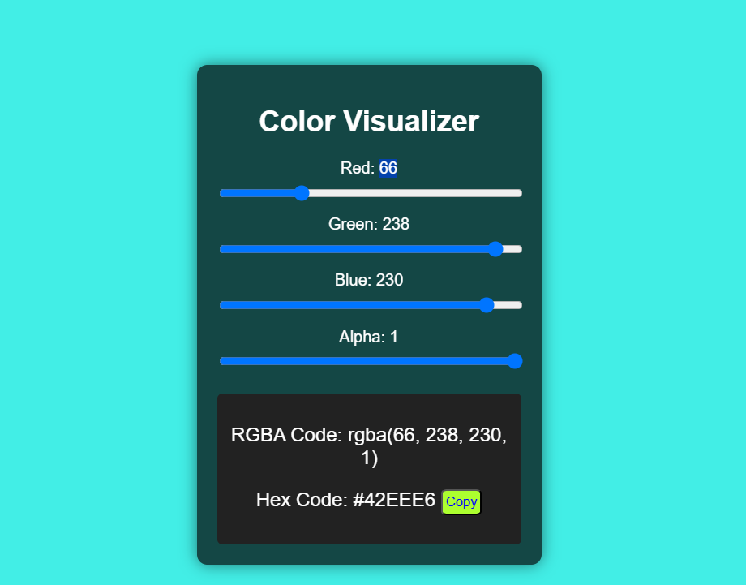
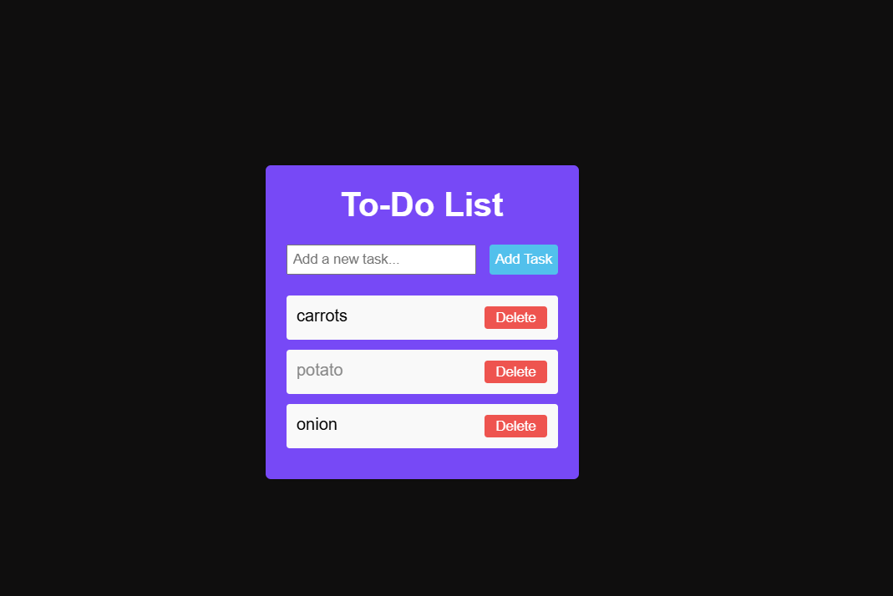

# My Projects Portfolio

Welcome to my portfolio website where I showcase a selection of web development projects I have worked on. Each project is designed to demonstrate my skills and passion for creating responsive and user-friendly websites. I hope you enjoy exploring my work!

## Table of Contents

- [Project 1: A Business Website](#project-1-a-business-website)
- [Project 2: Colorizer](#project-2-colorizer)
- [Project 3: ToDo List](#project-3-todo-list)
- [About Me](#about-me)

## Project 1: A Business Website


This is a small business portfolio website showcasing a basic layout with a header, about section, and links to the portfolio. 

- **Features:**
  - Responsive design
  - Simple and clean layout for a business
  - Interactive design with clear call-to-action buttons
  
[View Project](#) (link to the live version or repository)

---

## Project 2: Colorizer



A color picker web app that helps users select colors for their websites. 

- **Features:**
  - User-friendly interface
  - Displays selected color in RGB and Hex values
  - Ideal for web designers
  
[View Project](#) (link to the live version or repository)

---

## Project 3: ToDo List



A simple To-Do list application that allows users to add, edit, and delete tasks. 

- **Features:**
  - Add and remove tasks
  - Clear layout and design
  - Local storage to save tasks
  
[View Project](#) (link to the live version or repository)

---

## About Me

My name is Abdul Moiz, and I'm a web developer with a passion for creating clean, responsive, and user-friendly websites. I’ve been working remotely for the last few years and enjoy learning new technologies. Feel free to connect with me on my [LinkedIn](https://www.linkedin.com/in/your-linkedin-profile) or check out my other projects.

---

## Technologies Used

- HTML
- CSS
- Responsive Web Design
- Flexbox

## Installation

1. Clone the repository:
    ```bash
    git clone https://github.com/your-username/my-project.git
    ```

2. Navigate to the project directory:
    ```bash
    cd my-project
    ```

3. Open `index.html` in your browser to view the project.

---

## License

This project is open-source and available under the [MIT License](LICENSE).

